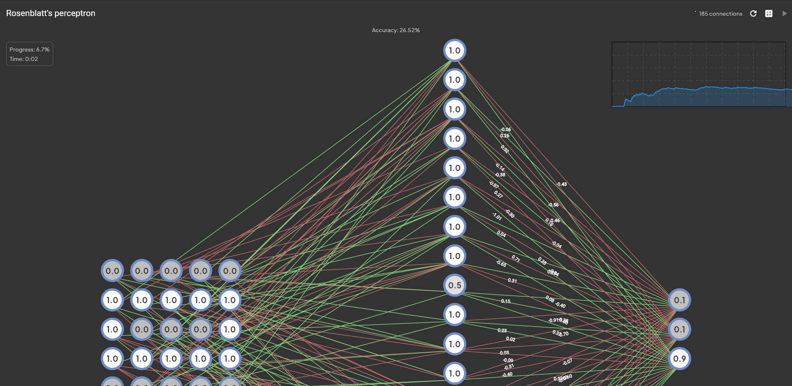
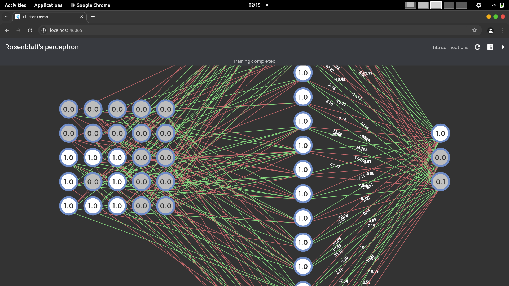
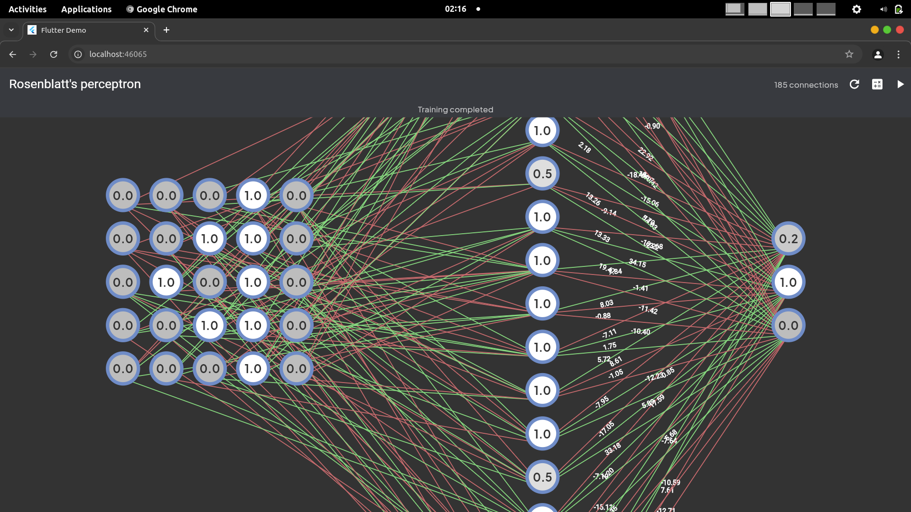
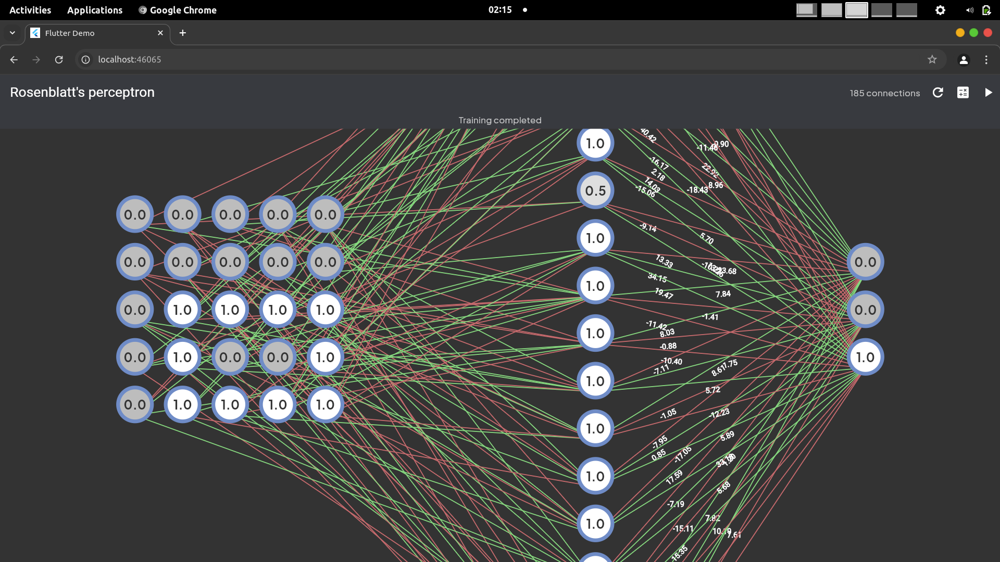

# Rosenblatt's Perceptron

A visual implementation and simulation of Rosenblatt's Perceptron neural network model using Flutter. This project demonstrates how a simple neural network can be trained to recognize basic geometric shapes (squares, triangles, and rectangles).

## Overview

This implementation showcases a three-layer neural network:
- **Input Layer (Sensory)**: A 10x10 grid of neurons representing the input shape pattern
- **Hidden Layer (Association)**: 20 neurons that process the input information
- **Output Layer (Response)**: 3 neurons representing the classification results (Square, Triangle, Rectangle)

The visualization displays the entire network, connections between neurons with their weights, and provides real-time training metrics including accuracy over time.

## Features

- **Interactive Visual Interface**: See the neural network in action
- **Real-time Training**: Watch as the network learns and improves
- **Live Weight Updates**: Observe how connection weights change during training
- **Shape Recognition**: The network can identify three basic geometric shapes:
  - First neuron: Square
  - Second neuron: Triangle
  - Third neuron: Rectangle
- **Training Metrics**: Monitor accuracy and progression during training
- **Shape Generation**: Includes a shape generator for creating training data variants

## How It Works

### Neural Network Architecture

The project implements a simple feedforward neural network with the following structure:

1. **Input Layer (5x5 grid)**: Represents a binary image of a shape, where:
   - 1.0 represents a filled pixel
   - 0.0 represents an empty pixel

2. **Hidden Layer (20 neurons)**: Each neuron receives input from a subset of the input layer neurons. The connections have weights that are adjusted during training.

3. **Output Layer (3 neurons)**: Each output neuron corresponds to a specific shape class:
   - First neuron: Square (1,0,0)
   - Second neuron: Triangle (0,1,0)
   - Third neuron: Rectangle (0,0,1)

### Training Process

The network uses supervised learning with the following steps:

1. **Forward Pass**:
   - Input is presented to the network
   - Signal propagates through the network via weighted connections
   - The activation function (sigmoid) determines neuron output

2. **Error Calculation**:
   - The difference between expected output and actual output is calculated

3. **Weight Adjustment**:
   - Weights are updated using backpropagation
   - The learning rate controls how quickly weights change

4. **Iterative Learning**:
   - This process repeats for multiple epochs until accuracy reaches an acceptable level

### Mathematical Foundations

The implementation uses:

- **Sigmoid Activation Function**: `f(x) = 1 / (1 + e^-x)`
- **Weight Updates**: Based on the error and learning rate
- **Backpropagation**: For adjusting weights based on contribution to the error

## Implementation Details

### Core Components

1. **Neurons (Units)**:
   - Visual representation with value display
   - Interactive (can be toggled on/off in the input layer)
   - Tooltip showing connection information

2. **Connections**:
   - Weighted links between neurons
   - Visual representation as arrows
   - Color-coded based on weight (positive/negative)
   - Optional weight display

3. **Training Visualizer**:
   - Real-time accuracy chart
   - Training progress indicators
   - Timer for training duration

### Key Classes

- `Unit`: Widget representing a single neuron
- `Connection`: Data structure for neuron connections
- `ArrowPainter`: Visualization of connections with weights
- `NetworkPainter`: Renders the entire network of connections
- `ShapeGenerator`: Creates training data variants
- `TrainingPattern`: Data structure for input-output pairs

### Notable Implementations

- **Dynamic Connection Generation**: Connections are generated between layers with random initial weights
- **Visual Weight Updates**: Connections change color and thickness based on weight adjustments
- **Interactive Training**: The training process can be observed step by step
- **Shape Variation Generator**: Creates multiple variations of base shapes for robust training

## Libraries

This project is notably minimal in its use of external libraries:

- **Flutter**: For the UI and visualization
- **fl_chart**: For plotting training metrics
- **numd**: A linear algebra library for matrix operations (also developed by me) - [Pub registry](https://pub.dev/packages/numd)

All neural network logic is implemented from scratch without relying on machine learning frameworks.

## Usage

### Running the Application

1. Clone the repository
2. Ensure Flutter is installed and set up
3. Run `flutter pub get` to install dependencies
4. Run `flutter run` to start the application

### Interacting with the Network

- **Regenerate Connections**: Click the refresh button to reset the network with new random weights
- **Train Network**: Click the play button to start training the network
- **Test Recognition**: Click "Calculate" to test the current input pattern
- **Create Custom Patterns**: Click on input layer neurons to toggle them on/off

## Results

### Network Output Examples

| Square Recognition | Triangle Recognition | Rectangle Recognition |
|:-----------------:|:-------------------:|:--------------------:|
|  |  |  |

*Images show the network's response to different input patterns after training*

### Training Metrics

The network typically achieves around 80% accuracy after 15 epochs of training. The accuracy plateau indicates that:

1. The model architecture may be sufficient for basic shape recognition
2. The training data variety impacts the network's ability to generalize
3. Some shapes are recognized more consistently than others

## Known Limitations

- **Shape Bias**: The shape generator has some bias toward certain variants of shapes
- **Training Stability**: Occasionally training may get stuck in local minima
- **Limited Shape Variety**: Currently only handles three basic shape classes
- **Fixed Network Size**: The architecture parameters are hardcoded rather than configurable

## Future Improvements

- **Improved Shape Generation**: More diverse and balanced training data
- **Configurable Architecture**: Allow changing the number of neurons in each layer
- **More Shape Classes**: Add support for additional geometric shapes
- **Save/Load Models**: Ability to save trained weights and load them later
- **Batch Training**: Implement mini-batch training for better performance
- **Momentum**: Add momentum to weight updates to improve convergence
- **Adaptive Learning Rate**: Implement learning rate schedules for better training

## How to Contribute

Contributions are welcome! Here are some ways you can help:

1. **Improve Shape Generation**: Create better, more varied training patterns
2. **Optimize Performance**: Look for ways to make the visualization more efficient
3. **Add Features**: Implement some of the suggested improvements
4. **Fix Bugs**: Address any issues you encounter
5. **Improve Documentation**: Enhance or correct the documentation

## License

MIT License

Copyright (c) 2025 Rishi Ahuja

Permission is hereby granted, free of charge, to any person obtaining a copy
of this software and associated documentation files (the "Software"), to deal
in the Software without restriction, including without limitation the rights
to use, copy, modify, merge, publish, distribute, sublicense, and/or sell
copies of the Software, and to permit persons to whom the Software is
furnished to do so, subject to the following conditions:

The above copyright notice and this permission notice shall be included in all
copies or substantial portions of the Software.

THE SOFTWARE IS PROVIDED "AS IS", WITHOUT WARRANTY OF ANY KIND, EXPRESS OR
IMPLIED, INCLUDING BUT NOT LIMITED TO THE WARRANTIES OF MERCHANTABILITY,
FITNESS FOR A PARTICULAR PURPOSE AND NONINFRINGEMENT. IN NO EVENT SHALL THE
AUTHORS OR COPYRIGHT HOLDERS BE LIABLE FOR ANY CLAIM, DAMAGES OR OTHER
LIABILITY, WHETHER IN AN ACTION OF CONTRACT, TORT OR OTHERWISE, ARISING FROM,
OUT OF OR IN CONNECTION WITH THE SOFTWARE OR THE USE OR OTHER DEALINGS IN THE
SOFTWARE.